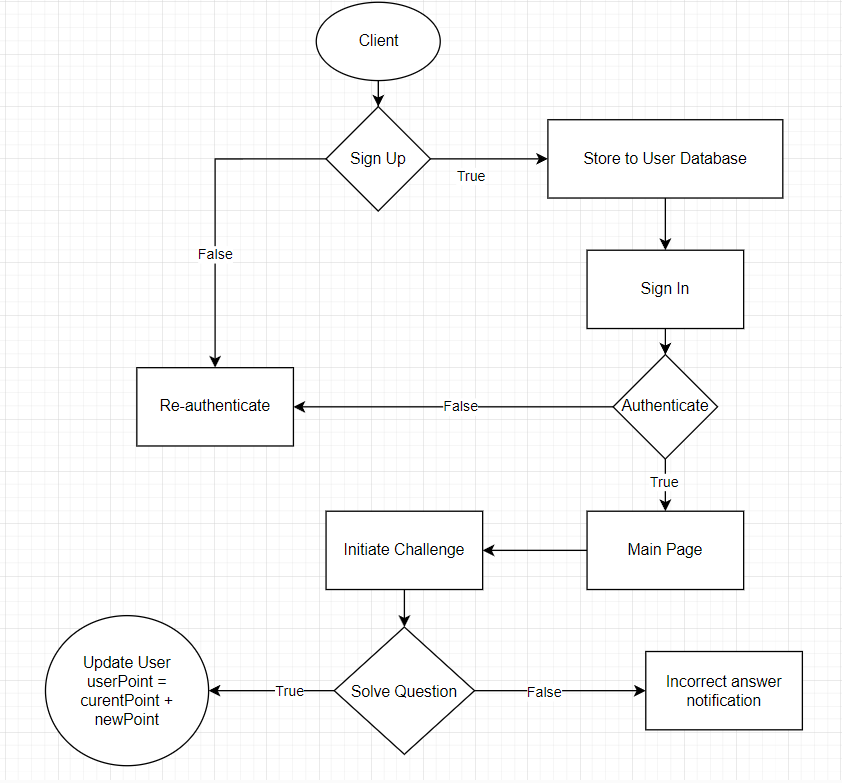

## Overview

This module manages the updating and retrieval of user scores for the scoreboard feature on the website. It ensures real-time updates of the top 10 user scores and includes security measures to prevent unauthorized modifications.

## Software Requirements

1. **Score Board Display**: Displays the top 10 user scores on the website.
2. **Real-time Updates**: Updates the scoreboard in real-time to reflect changes instantly.
3. **User Action**: Users perform actions to increase their scores (details of actions are abstracted).
4. **API Call**: After completing an action, an API call updates the score on the application server.
5. **Score Increase**: Each user action can only increase the score once; duplicate updates are ignored.
6. **Security**: Implements measures to prevent unauthorized score modifications and ensure data integrity.

## API Endpoints

### `GET /scores`

- **Description**: Retrieves the top 10 user scores.
- **Request Headers**: None required.
- **Response**:
  - **Status 200 OK**:
    ```json
    {
      "success": true,
      "data": [
        {
          "userId": "string",
          "username": "string",
          "score": "integer"
        },
        ...
      ]
    }
    ```
  - **Status 500 Internal Server Error**:
    ```json
    {
      "success": false,
      "message": "Internal server error"
    }
    ```
    - **Description**: An unexpected error occurred on the server while processing the request. This could be due to a system failure or an unforeseen error.

### `POST /scores/update`

- **Description**: Updates a user's score upon completion of an action. Only authenticated users can update their scores.
- **Request Headers**:
  - `Authorization`: Bearer token for authentication.
- **Request Body**:
  ```json
  {
    "userId": "string",
    "scoreDelta": "integer"
  }
  ```
  - **userId (string)**: The ID of the user whose score is being updated.
  - **scoreDelta (integer)**: The amount by which the user's score should be increased. Must be a positive integer.

Response:

- **Status 200 OK**:
  ```json
  {
    "success": true,
    "message": "Score updated successfully"
  }
  ```
- **Status 400 Bad Request**:
  ```json
  {
    "success": false,
    "message": "Invalid request parameters"
  }
  ```
  - **Description**: Invalid request parameters. This can happen if userId is missing or scoreDelta is not a positive integer.
- **Status 401 Unauthorized**:
  ```json
  {
    "success": false,
    "message": "Unauthorized access"
  }
  ```
  - **Description**: The authentication token is missing, invalid, or has expired.
- **Status 403 Forbidden**:
  ```json
  {
    "success": false,
    "message": "Action not allowed"
  }
  ```
  - **Description**: The user is authenticated but does not have permission to take action, for example, trying to update someone else's score without permission.
- **Status 500 Internal Server Error**:
  ```json
  {
    "success": false,
    "message": "Internal server error"
  }
  ```
  - **Description**: An unexpected error occurred on the server while processing the request. It could be due to a system error or unforeseen error.

## Flow of Execution

1. A user completes an action that should increase their score.
2. The client application sends a POST request to /scores/update, including the user's authentication token and score data.
3. The API service verifies the provided token to ensure the request is authorized.
4. If authorized, the request is queued for asynchronous processing (e.g., with Bull Queue).
5. The asynchronous task calculates the score increase and stores it temporarily in a caching layer (e.g., Redis).
6. The API service retrieves the score increase from the cache and updates the user's score in the database.
7. The updated top 10 scores are fetched from the database and returned to the client.

## Diagram



## Comments for Improvement

- Asynchronous Processing: Use an asynchronous task queue (e.g., Bull Queue) for efficient handling of score updates, reducing latency and improving scalability.
- Caching: Implement a caching layer (e.g., Redis) to temporarily store score updates and optimize performance.
- Error Handling and Logging: Implement comprehensive error handling and logging to track and manage exceptions effectively. This includes monitoring failed requests and identifying issues promptly.
- Rate Limiting: Consider implementing rate limiting to prevent abuse of the score update endpoint and mitigate potential attacks.
- Validation: Ensure robust validation of request parameters to prevent invalid data from being processed.
